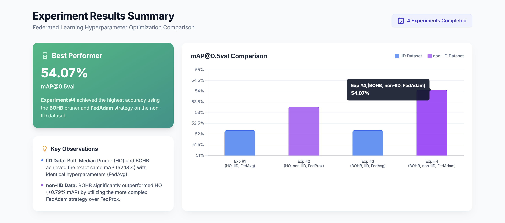
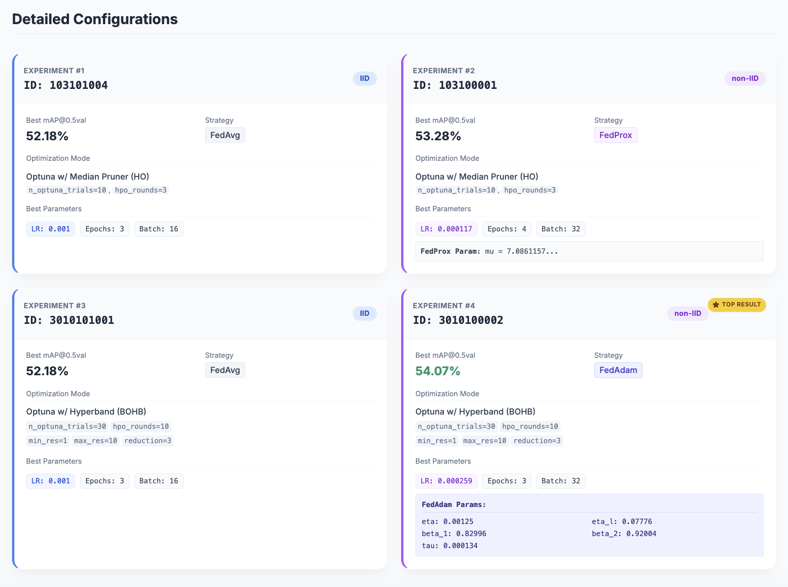
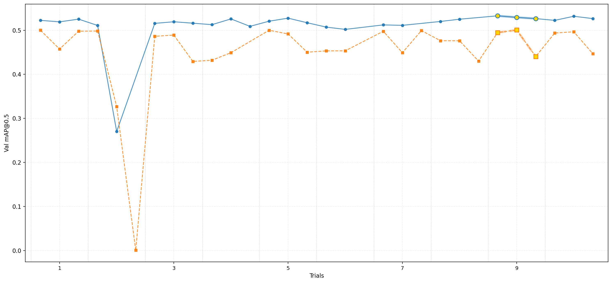
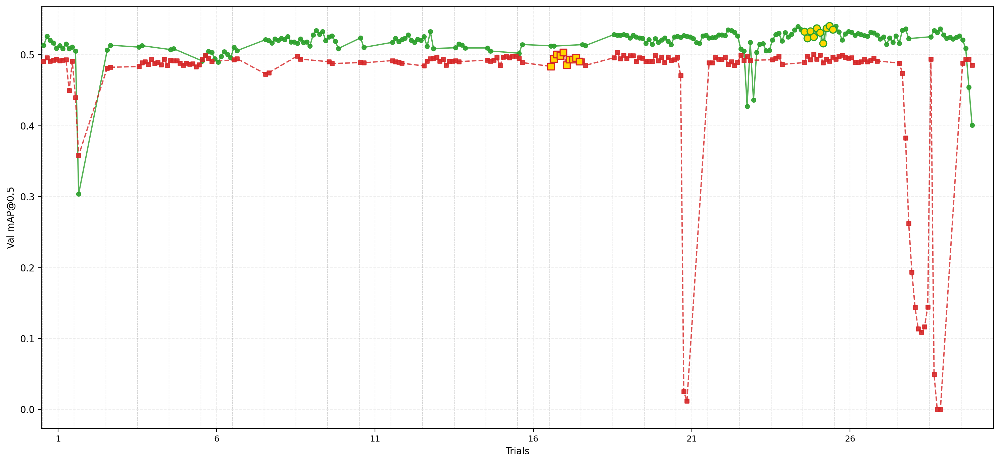

The current robust experiments map:

| EXP_ID⇘ | Optuna ONLY | BOHB |
|----------|----------|----------|
| Dataset_100 (Fully IID)   | 103101004   | 3010101001   |
| Dataset_000 (Fully non-IID)   | 103100001   | 3010100002   |

=> BHOB pruner configs: min = 1, max = hop_rounds, and rf = 3

--- 

## Check the [Experiment Results Analysis (HTML Page)](https://github.com/TawfikYasser/fly-bold/blob/main/experiments_summary.html) for a comperhinsive analysis of all experiments results, including the ones mentioned in this map and more.

---

### Experiments mAP@0.5val Plot Comparison

#### First Plot: Optuna vs BOHB for IID Dataset
The following plot, shows the mAP@0.5val comparision between the 2 experiments (Optuna and BOHB) for the IID Dataset.
The Blue line represents the Optuna experiment (103101004), while the Orange line represents the BOHB experiment (3010101001).
Both experiments were run for 10 trials, and the plot shows the mAP@0.5val values for each trial, as well as the average mAP@0.5val across all trials.
The maximum mAP@0.5val achieved by Optuna and BOHB for both experimetns where using the manual hyperparameters configurations, which are FedAvg, 0.001 LR, 16 local epochs, and 3 local epochs was 52.18%. This means that no improvment by applying either Optuna or BOHB. The golden circles in the plot represent the maximum mAP@0.5val achieved during the optimization process, which is in this case for both experiments less than the maximum mAP@0.5val achieved by the manual hyperparameters configuration.

#### Second Plot: Optuna vs BOHB for non-IID Dataset
The following plot, shows the mAP@0.5val comparision between the 2 experiments (Optuna and BOHB) for the non-IID Dataset.
The Blue line represents the Optuna experiment (103100001), while the Orange line represents the BOHB experiment (3010100002).
Both experiments were run for 30 trials, each with 10 server rounds, and the plot shows the mAP@0.5val values for each trial, as well as the golden circles representing the maximum mAP@0.5val achieved during the optimization process. The maximum mAP@0.5val achieved by Optuna was 53.28%, while the maximum mAP@0.5val achieved by BOHB was 54.07%. This means that both Optuna and BOHB were able to find hyperparameters configurations that improved the mAP@0.5val compared to the manual hyperparameters configuration, which achieved a maximum mAP@0.5val of 53.09% on the non-IID dataset. The golden circles in the plot represent the maximum mAP@0.5val achieved during the optimization process, which is in this case for both experiments higher than the maximum mAP@0.5val achieved by the manual hyperparameters configuration.

---

### Following Experiments using Optimized Hyperparameters Configurations

#### 1. non-IID-bohb (ID: 301033200031)

For 30 server rounds, we got 54.10% mAP@0.5val. Check the results here: [non-IID-bohb Results Analysis](https://github.com/TawfikYasser/fly-bold/blob/main/flower/experiments_outputs/analysis_exp_301033200031/00_SUMMARY_REPORT_301033200031.txt)

#### 2. non-IID-optuna (ID: 201033200032)

It is a resume for 301033200031 experiment, with 20 more server rounds, to complete 50 total server rounds, however, we didn't get any improvment in the mAP@0.5val. Check the results here: [non-IID-optuna Results Analysis 20 more rounds](https://github.com/TawfikYasser/fly-bold/blob/main/flower/experiments_outputs/analysis_exp_201033200032/00_SUMMARY_REPORT_201033200032.txt)

---

### FILES

* [103101004 Results Analysis](https://github.com/TawfikYasser/fly-bold/blob/main/results_103101004.html)
* [103101004 Run Logs](https://github.com/TawfikYasser/fly-bold/blob/main/103101004.txt)
* [103101004 HPO DB File](https://github.com/TawfikYasser/fly-bold/blob/main/EXP_YOLOv5_s_detection_103101004_hpo.db)

* [103100001 Results Analysis](https://github.com/TawfikYasser/fly-bold/blob/main/results_103100001.html)
* [103100001 Run Logs](https://github.com/TawfikYasser/fly-bold/blob/main/103100001.txt)
* [103100001 HPO DB File](https://github.com/TawfikYasser/fly-bold/blob/main/EXP_YOLOv5_s_detection_103100001_hpo.db)

* [3010101001 Results Analysis](https://github.com/TawfikYasser/fly-bold/blob/main/results_3010101001.html)
* [3010101001 Run Logs](https://github.com/TawfikYasser/fly-bold/blob/main/3010101001.txt)
* [3010101001 HPO DB File](https://github.com/TawfikYasser/fly-bold/blob/main/EXP_YOLOv5_s_detection_3010101001_hpo.db)

* [3010100002 Results Analysis](https://github.com/TawfikYasser/fly-bold/blob/main/results_3010100002.html)
* [3010100002 Run Logs](https://github.com/TawfikYasser/fly-bold/blob/main/3010100002.txt)
* [3010100002 HPO DB File](https://github.com/TawfikYasser/fly-bold/blob/main/EXP_YOLOv5_s_detection_3010100002_hpo.db)
