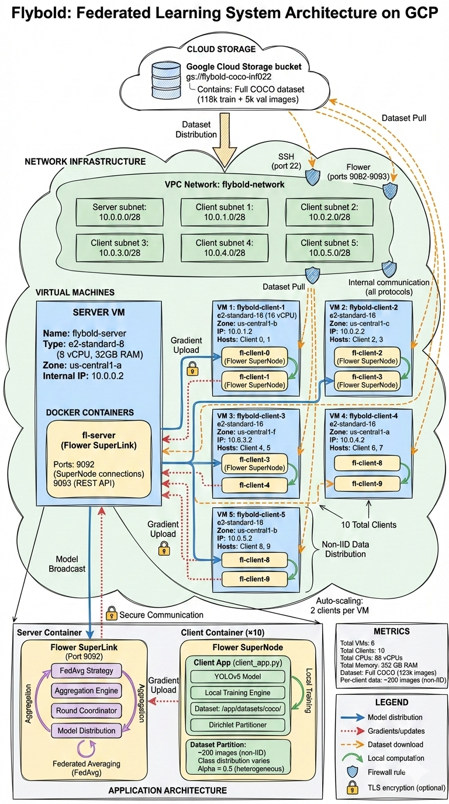

# Flybold: Federated Learning for YOLOv5 on GCP

Complete automation suite for deploying Flower Federated Learning with YOLOv5 object detection on Google Cloud Platform.

## 🎯 Overview

This project automates the deployment of a production-ready Federated Learning infrastructure on GCP featuring:

- ✅ **GCS bucket** for centralized COCO dataset storage
- ✅ **1 server VM** (e2-standard-8) + **5 client VMs** (e2-standard-16 each)
- ✅ **10 total clients** (2 clients per VM as containers)
- ✅ **Dirichlet-based non-IID data partitioning**
- ✅ **Dynamic parameter updates** without infrastructure recreation
- ✅ **Individual client management** (start/stop/restart any of 10 clients)
- ✅ **Hot code updates** without full rebuild
- ✅ **Optional GPU and TLS support**

## High-level Overview of the System Architecture


## 📋 Prerequisites

- **GCP Account** with billing enabled
- **Project ID**: `inf022` (configured in scripts)
- **gcloud CLI** installed and authenticated (`gcloud auth login`)
- **Docker** installed locally
- **Docker Hub account** for image storage
- **Sufficient GCP quotas**:
  - 6 VMs (1 e2-standard-8 + 5 e2-standard-16)
  - ~100GB total disk
  - External IPs for all VMs

## ⚡ Quick Start

### Full Setup (4 Steps)

```bash
# 1. Setup bucket and download COCO dataset (~60-90 minutes)
./setup-bucket-dataset.sh

# 2. Create GCP infrastructure (VMs, networks) (~5 minutes)
./setup-infrastructure.sh

# 3. Partition Dataset (~10 minutes)
./run-partition-on-temp-vm.sh

# 4. Build and push Docker image (~15 minutes)
./build-push-image.sh

# 5. Deploy application with interactive prompts (~20 minutes)
./deploy-application.sh
```

**Total time**: ~110-140 minutes (most time is COCO download)

### What Gets Created

**Infrastructure**:
- GCS Bucket: `gs://flybold-coco-inf022/`
- VPC: `flybold-network` with 6 subnets
- 1 Server VM + 5 Client VMs
- Firewall rules for internal communication

**Deployed**:
- Flower SuperLink on server VM
- 10 Flower SuperNodes (2 per client VM)
- COCO dataset subsets on each client VM

## 📂 Project Structure

```
flybold/
├── setup-bucket-dataset.sh       # Create GCS bucket, download COCO
├── setup-infrastructure.sh       # Create VMs and networks
├── run-partition-on-temp-vm.sh   # Partition dataset on temp VM (New!)
├── partition-dataset.sh          # Partition logic (runs on temp VM)
├── build-push-image.sh           # Build/push Docker image
├── deploy-application.sh         # Deploy FL application
├── finish.sh                     # Monitor training and download results (New!)
├── manage-clients.sh             # Manage individual clients
├── update-code.sh                # Hot update code
├── download-files.sh             # Download results from server
├── cleanup.sh                    # Delete all resources
├── monitor-resources.sh          # Real-time resource monitoring
├── check-client-data.sh          # Verify dataset on clients
├── clean-client-datasets.sh      # Clean datasets from clients
├── refresh-vm-ips.sh             # Refresh IP info in vm-info.txt
├── view-all-clients-logs.sh      # Stream logs from all clients
├── src/
│   └── flower_benchmarks/
│       ├── client_app.py         # FL Client (modified)
│       ├── server_app.py         # FL Server (modified)
│       ├── task.py               # Training/eval functions
│       └── plugins/yolov5/       # YOLO utilities
├── yolov5/                       # YOLOv5 repository
├── Dockerfile                    # Container image (modified)
├── pyproject.toml                # Flower config (modified)
├── requirements.txt              # Python dependencies
├── generate_certs.sh             # TLS certificate generator
└── README.md                     # This file
```

## 🔧 Detailed Usage

### Script: Setup Bucket and Dataset

Downloads full COCO dataset (train2017 + val2017) to GCS bucket.

```bash
./setup-bucket-dataset.sh
```

**What it does**:
1. Creates `gs://flybold-coco-inf022/` bucket
2. Initializes `run_id.txt` counter
3. Spins up temporary VM for download
4. Downloads COCO train2017 (~118k images)
5. Downloads COCO val2017 (~5k images)
6. Converts annotations to YOLO format
7. Uploads everything to GCS
8. Deletes temporary VM

**Time**: 60-90 minutes  
**Cost**: ~$0.50 (temporary VM usage)

**Skip if**: Dataset already in bucket (script checks automatically)

---

### Script: Setup Infrastructure

Creates all GCP resources for FL deployment.

```bash
./setup-infrastructure.sh
```

**What it creates**:

| Resource | Specification | Purpose |
|----------|--------------|---------|
| VPC Network | `flybold-network` | Isolated network |
| Server Subnet | `10.0.0.0/28` | Server VM network |
| Client Subnets | `10.0.1-5.0/28` | Client VM networks |
| Server VM | e2-standard-8 | Flower SuperLink |
| Client VMs (5x) | e2-standard-16 | Flower SuperNodes |
| Firewall Rules | Internal + SSH | Communication |

**VM Distribution**:
- **flybold-server**: `us-central1-a`
- **flybold-client-1**: `us-central1-b` (clients 0, 1)
- **flybold-client-2**: `us-central1-c` (clients 2, 3)
- **flybold-client-3**: `us-central1-f` (clients 4, 5)
- **flybold-client-4**: `us-central1-a` (clients 6, 7)
- **flybold-client-5**: `us-central1-b` (clients 8, 9)

**Output**: `vm-info.txt` with all VM details

**Time**: ~5 minutes

---

### Script: Partition Dataset

Partitions the COCO dataset using Dirichlet distribution on a temporary VM.

```bash
./run-partition-on-temp-vm.sh
```

**Interactive Configuration**:
- **Dataset ID**: Unique identifier for this partition set (e.g., `exp1`, `hetero_0.1`).
- **IID Clients**: Comma-separated list (e.g., `0,3`) or `none` for all non-IID.

**What it does**:
1. Creates a temporary VM (`partition-tmp-vm`).
2. Generates a partition manifest (`partition_manifest_dataset_{id}.json`) using `generate_partitions.py`.
3. Distributes the partitioned data (file lists) to client VMs.
4. Clients verify/download their data relative to the GCS bucket.
5. Saves outputs to `partition_outputs/`.

**Note**: You can have multiple datasets on the same VMs. Use the `Dataset ID` to choose which one to train on during deployment.

**Time**: ~10 minutes

---

### Script: Build and Push Image

Builds Docker image with FL application and pushes to Docker Hub.

```bash
./build-push-image.sh
```

**Interactive prompts**:
- Docker Hub username (saved in `.docker_username`)

**Image name**: `{username}/fly-bold-image:latest`

**What's included**:
- Flower framework
- YOLOv5 dependencies
- PyTorch (CPU)
- Google Cloud SDK (for GCS access)
- All application code

**Time**: ~15 minutes  
**Output**: `docker-image-info.txt`

---

### Script: Deploy Application

Deploys FL server and clients with customizable parameters.

```bash
./deploy-application.sh
```

**Interactive Configuration**:

```
Enable GPU? (y/n) [n]: n
Enable TLS? (y/n) [n]: n
Training images per client [2000]: 2000
Validation images per client [500]: 500
Number of rounds [30]: 30
Local epochs [5]: 5
Batch size [24]: 24
Fraction train [0.8]: 0.8
Fraction evaluate [0.8]: 0.8
Learning rate [0.005]: 0.005
YOLO size (n/s/m/l/x) [s]: s
Image size [512]: 512
Dataset choice [1]: dataset_5
Use pretrained weights? (y/n) [y]: y
Dirichlet alpha [0.5]: 0.5
```

**Dynamic Dataset Choice**: The "Dataset choice" prompt allows you to select which pre-partitioned dataset (by its `DATASET_ID`) the clients should use for this run.

**What it does**:
1. Prompts for parameters (or uses existing `.env`)
2. Gets/increments `run_id` from GCS
3. Saves config to `.env` and `gs://bucket/configs/run_{id}_config.json`
4. Updates `pyproject.toml` with parameters
5. Deploys server on `flybold-server`
6. Deploys 2 clients per VM (5 VMs = 10 clients)
7. Downloads COCO subsets on each client VM
8. Starts all containers

**Time**: ~20 minutes (includes dataset download on clients)

**Dynamic Updates**: Edit `.env` and re-run this script to update parameters without recreating infrastructure.

---

### Script: Manage Clients

Control individual clients at any time.

```bash
# View status of all clients
./manage-clients.sh status

# View logs for client 5
./manage-clients.sh logs --client 5

# Stop client 3
./manage-clients.sh stop --client 3

# Restart client 7
./manage-clients.sh restart --client 7

# Start all clients
./manage-clients.sh start --all

# Stop all clients
./manage-clients.sh stop --all
```

**Client ID Mapping**:
- VM 1: Clients 0, 1
- VM 2: Clients 2, 3
- VM 3: Clients 4, 5
- VM 4: Clients 6, 7
- VM 5: Clients 8, 9

**Use cases**:
- Simulate client failures
- Debug specific clients
- Progressive scaling
- Dynamic rebalancing

---

### Script: Update Code

Deploy code changes without rebuilding infrastructure.

```bash
# Edit your code
nano src/flower_benchmarks/client_app.py
nano src/flower_benchmarks/server_app.py

# Push changes to all VMs
./update-code.sh
```

**What it does**:
1. Copies `src/` and `pyproject.toml` to all VMs
2. Restarts containers

**Time**: ~2 minutes

**When to use**:
- Fix bugs
- Adjust training logic
- Modify aggregation strategy
- Change logging

---

### Script: Download Files

Retrieve results from server VM.

```bash
./download-files.sh
```

**Interactive file browser**:
```
Available files:
[1] /app/EXP_YOLOv5_s_detection_25_final_model.pt
[2] /app/EXP_YOLOv5_s_detection_25_logs.json
[3] /app/checkpoints/round_10.pt

Enter file number(s) to download (comma-separated, or 'all'): 1,2
```

**Downloads to**: `./downloads/`

**Typical files**:
- `*_final_model.pt`: Trained YOLO weights
- `*_logs.json`: Round-by-round metrics
- `checkpoints/*.pt`: Intermediate checkpoints

---

### Script: Finish training

Automatically monitor for training completion and collect results.

```bash
./finish.sh
```

**What it does**:
1. Monitors the server container for the creation of the final logs file (`*_logs.json`).
2. Downloads the log file (and optionally models) to your local `./downloads/` folder.
3. (Optional) Stops all VMs once training is detected as finished.

---

### Script: Cleanup

Delete all GCP resources.

```bash
./cleanup.sh
```

**Confirmation required**: Type `DELETE` to proceed

**What it deletes**:
- All 6 VMs
- Network and subnets
- Firewall rules
- GCS bucket (including dataset)
- Local config files

**Time**: ~2 minutes

---

### Helper Scripts

- **`monitor-resources.sh`**: Shows real-time CPU/RAM usage of VMs and containers.
  ```bash
  ./monitor-resources.sh
  ```
- **`check-client-data.sh`**: Verifies that the COCO dataset is correctly partitioned and downloaded on all client VMs.
- **`clean-client-datasets.sh`**: Deletes dataset files from client VMs to free up space or force a re-download.
- **`refresh-vm-ips.sh`**: Updates `vm-info.txt` with current IPs (useful if VMs were stopped/started).
- **`view-all-clients-logs.sh`**: Streams and multiplexes logs from all 10 clients into a single terminal window, prefixed by VM name.
- **`commands.txt`**: A reference file containing manual commands for advanced operations (e.g., `flwr run`, manual container stops).

---

## 🛠 Advanced Tooling (Manual Commands)

For granular control, you can use these commands (also found in `commands.txt`):

**Run training manually**:
```bash
gcloud compute ssh flybold-server --zone=us-central1-a --command='cd /app && sudo docker compose exec fl-server flwr run .'
```

**Stop a specific Flower job**:
```bash
gcloud compute ssh flybold-server --zone=us-central1-a --command='cd /app && sudo docker compose exec fl-server flwr stop <JOB_ID>'
```

---

## 🎮 Starting Training

After deployment, start the FL training:

```bash
# SSH to server
gcloud compute ssh flybold-server --zone=us-central1-a

# Navigate to app directory
cd /app

# Start training
flwr run .
```

**Monitoring progress**:
```bash
# View server logs
gcloud compute ssh flybold-server --zone=us-central1-a \
  --command='sudo docker logs -f fl-server'

# View specific client logs
./manage-clients.sh logs --client 3

# Check all statuses
./manage-clients.sh status
```

---

## 📊 Configuration Details

### Environment Variables (`.env`)

Generated by `deploy-application.sh`:

```bash
ENABLE_GPU=false
ENABLE_TLS=false
INSECURE=true
N_TRAIN=2000              # Training images per client
N_VAL=500                 # Validation images per client
RUN_ID=25                 # Auto-incremented
NUM_SERVER_ROUNDS=30
NUM_CLIENTS=10
LOCAL_EPOCHS=5
BATCH_SIZE=24
FRACTION_TRAIN=0.8
FRACTION_EVALUATE=0.8
LR=0.005
YOLO_SIZE=s               # n/s/m/l/x
IMG_SIZE=512
DIRICHLET_ALPHA=0.5
NUM_CPUS=4
NUM_GPUS=0
FLWR_SUPERLINK_ADDRESS=0.0.0.0:9092
BUCKET_NAME=flybold-coco-inf022
DOCKER_IMAGE={username}/fly-bold-image:latest
```

### Dataset Partitioning (Refined "Partition First" Logic)

The system uses a sophisticated **Partition-First** approach to ensure fair but heterogeneous data distribution:

1. **Phase 1: Partitioning (The Lottery)**
   - **Client 0 (IID)**: Guaranteed a fixed uniform slice (10%) of every class.
   - **Clients 1-9 (Non-IID)**: Compete for the remaining 90% via Dirichlet distribution (controlled by `alpha`).

2. **Phase 2: Capping & Splitting**
   - Each client is assigned a **Random "Train Cap"** (between `min_train` and `max_train`).
   - The script checks the *actual* number of images received in Phase 1.
   - **Training Set**: Taken from the pool, but strictly **Capped** at the client's random target.
   - **Validation Set**: Strictly enforced to vary **exactly 50% of the Training Set size**.
   - *Note*: Any excess images beyond the cap+validation are discarded to maintain strict consistency.

**Example Result**:
- **Rich Client** (Received 10k images, Cap 4k): Gets **4000 Train**, **2000 Val**. Discards 4k.
- **Poor Client** (Received 1k images, Cap 4k): Gets **666 Train**, **333 Val**. Discards 0.

---

## 💰 Cost Estimation

### Compute Costs (per hour)

| Resource | Type | vCPUs | Memory | Cost/hr |
|----------|------|-------|--------|---------|
| Server VM | e2-standard-8 | 8 | 32GB | $0.27 |
| Client VMs (5x) | e2-standard-16 | 80 | 320GB | $1.35 |
| **Total** | | | | **$1.62/hr** |

### Storage Costs

| Resource | Size | Cost/month |
|----------|------|------------|
| GCS Bucket | ~25GB | $0.50 |
| VM Disks (6x 100GB) | 600GB | $60 |
| **Total** | | **$60.50/mo** |

### Total Costs

| Usage | Duration | Cost |
|-------|----------|------|
| Setup (one-time) | 2 hours | $3.50 |
| 30-round training | ~6 hours | $10 |
| **Per experiment** | | **~$13.50** |

**Cost saving tips**:
- Stop VMs when not in use: `gcloud compute instances stop <vm-name>`
- Use preemptible instances (70% discount)
- Delete resources after experiments: `./cleanup.sh`

---

## 🔍 Monitoring and Logs

### Server Logs

```bash
gcloud compute ssh flybold-server --zone=us-central1-a \
  --command='sudo docker logs -f fl-server'
```

### Client Logs

```bash
# View specific client
./manage-clients.sh logs --client 5

# Or directly
gcloud compute ssh flybold-client-3 --zone=us-central1-f \
  --command='sudo docker logs -f fl-client-5'
```

### View All Statuses

```bash
./manage-clients.sh status
```

Output:
```
=== Flybold Cluster Status ===

[SERVER: flybold-server]
NAME        STATUS   PORTS
fl-server   Up       0.0.0.0:9092->9092/tcp

[CLIENT VM 1: flybold-client-1 - Clients 0, 1]
NAME            STATUS   PORTS
fl-client-0     Up
fl-client-1     Up

[CLIENT VM 2: flybold-client-2 - Clients 2, 3]
...
```

---

## 🛠 Troubleshooting

### VMs Not Accessible

```bash
# List all VMs
gcloud compute instances list

# Start stopped VM
gcloud compute instances start flybold-client-1 --zone=us-central1-b
```

### Docker Not Running on VM

```bash
# SSH to VM
gcloud compute ssh flybold-client-1 --zone=us-central1-b

# Check Docker status
sudo systemctl status docker

# Start Docker
sudo systemctl start docker
```

### Clients Not Connecting to Server

1. Check server is running:
```bash
./manage-clients.sh status
```

2. Verify internal IPs in `vm-info.txt`

3. Test connectivity from client VM:
```bash
gcloud compute ssh flybold-client-1 --zone=us-central1-b
timeout 5 bash -c 'cat < /dev/null > /dev/tcp/10.0.0.2/9092'
```

4. Check firewall rules:
```bash
gcloud compute firewall-rules list --filter="network:flybold-network"
```

### Dataset Not Downloading

Check GCS bucket access:
```bash
gcloud compute ssh flybold-client-1 --zone=us-central1-b
gsutil ls gs://flybold-coco-inf022/coco/images/train2017/ | head
```

If fails, verify service account permissions:
```bash
gcloud projects get-iam-policy inf022 \
  --flatten="bindings[].members" \
  --filter="bindings.members:*compute@*"
```

### Container Crashes

```bash
# View logs for crashed client
./manage-clients.sh logs --client 3

# Restart client
./manage-clients.sh restart --client 3
```

### Out of Memory

Reduce batch size in `.env`:
```bash
BATCH_SIZE=16  # Was 24
```

Then re-deploy:
```bash
./deploy-application.sh  # Uses existing .env
```

---

## 🔐 Security Considerations

### TLS Encryption

Enable TLS during deployment:
```bash
./deploy-application.sh
# Answer 'y' to "Enable TLS?"
```

Generates certificates with `generate_certs.sh`:
- `certs/ca.crt`: Certificate Authority
- `certs/server.crt`: Server certificate
- `certs/client.crt`: Client certificate

### Network Isolation

- VMs use internal IPs for communication
- External IPs only for SSH access
- Firewall rules limit traffic to:
  - Port 22 (SSH)
  - Ports 9092-9093 (Flower internal)
  - Internal subnet traffic only

### Service Account Permissions

Default compute service account has:
- `storage.objects.get` (read GCS)
- `storage.objects.create` (write GCS)
- `compute.instances.*` (manage VMs)

---

## 📈 Scaling Considerations

### Adding More Clients

To increase from 10 to 20 clients:

1. Modify `deploy-application.sh`:
```bash
# Change VM loop from 5 to 10
for i in $(seq 1 10); do
```

2. Add 5 more VMs in `setup-infrastructure.sh`:
```bash
CLIENT_COUNT=10  # Was 5
```

3. Update `NUM_CLIENTS` in `.env`:
```bash
NUM_CLIENTS=20
```

### GPU Support

Enable GPUs during deployment:
```bash
./deploy-application.sh
# Answer 'y' to "Enable GPU?"
# Specify CPUs and GPUs per client
```

**Note**: Requires GPU quota and GPU-enabled VMs (n1-standard with T4/V100)

---

## 📚 Advanced Usage

### Custom Data Distribution

Modify Dirichlet alpha per run:
```bash
# More heterogeneous (harder FL scenario)
DIRICHLET_ALPHA=0.1

# More homogeneous (easier FL scenario)
DIRICHLET_ALPHA=2.0
```

### Different YOLO Sizes

```bash
YOLO_SIZE=n  # Fastest, smallest
YOLO_SIZE=s  # Balanced (default)
YOLO_SIZE=m  # Larger
YOLO_SIZE=l  # Much larger
YOLO_SIZE=x  # Largest
```

### Multiple Experiments

Each run gets unique `RUN_ID`:
```bash
# Run 1
./deploy-application.sh  # Creates run_id=1

# Run 2 (without cleanup)
./deploy-application.sh  # Creates run_id=2
```

Configs saved to:
- `gs://flybold-coco-inf022/configs/run_1_config.json`
- `gs://flybold-coco-inf022/configs/run_2_config.json`

---

## 🎓 Research Use Cases

This setup is ideal for:

1. **FL Algorithm Research**
   - Test new aggregation strategies
   - Compare federated vs centralized
   - Analyze convergence rates

2. **Non-IID Data Studies**
   - Vary Dirichlet alpha
   - Measure impact on accuracy
   - Study client drift

3. **System Robustness**
   - Simulate client failures
   - Test recovery mechanisms
   - Analyze communication costs

4. **Scalability Testing**
   - Vary client count (10 → 100)
   - Measure training time
   - Analyze bandwidth usage

---

## 🤝 Contributing

To modify this setup:

1. **Change VM sizes**: Edit `setup-infrastructure.sh`
2. **Modify FL code**: Edit `src/`, then run `./update-code.sh`
3. **Adjust monitoring**: Currently minimal (logs only)
4. **Add features**: Create new scripts following naming pattern

---

## 📄 License

This project is provided as-is for educational and research purposes.

---

## 🆘 Support

### Quick Reference

| Task | Command |
|------|---------|
| Full setup | `Script 1→2→3→4` |
| Start training | `gcloud compute ssh flybold-server`, then `flwr run .` |
| View status | `./manage-clients.sh status` |
| Stop client | `./manage-clients.sh stop --client 3` |
| Update code | `./update-code.sh` |
| Download results | `./download-files.sh` |
| Cleanup all | `./cleanup.sh` |

### Common Commands

```bash
# SSH to server
gcloud compute ssh flybold-server --zone=us-central1-a

# SSH to client VM
gcloud compute ssh flybold-client-3 --zone=us-central1-f

# List all VMs
gcloud compute instances list

# Check GCS bucket
gsutil ls -r gs://flybold-coco-inf022/

# View run configs
gsutil cat gs://flybold-coco-inf022/configs/run_25_config.json
```

---

**Happy Federated Learning! 🚀**

For questions or issues, review the troubleshooting section or check VM/container logs.